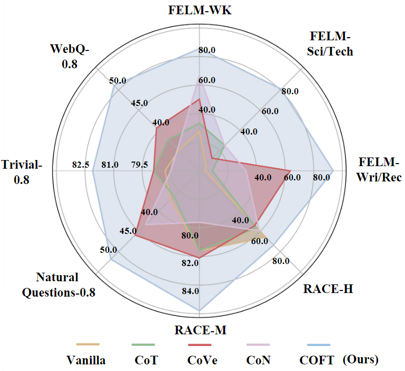
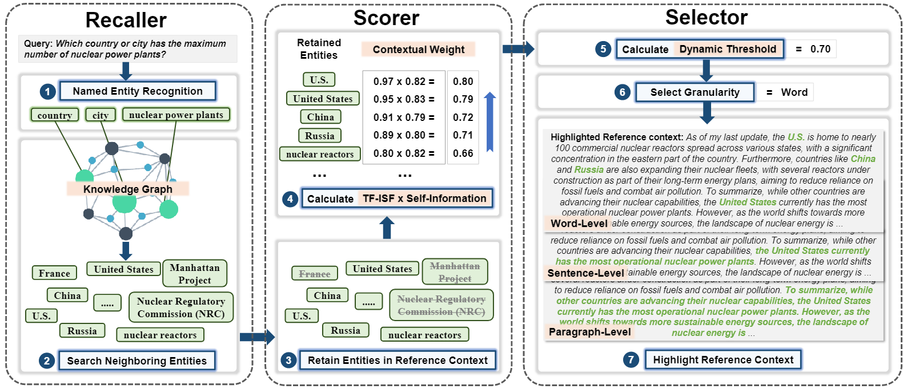
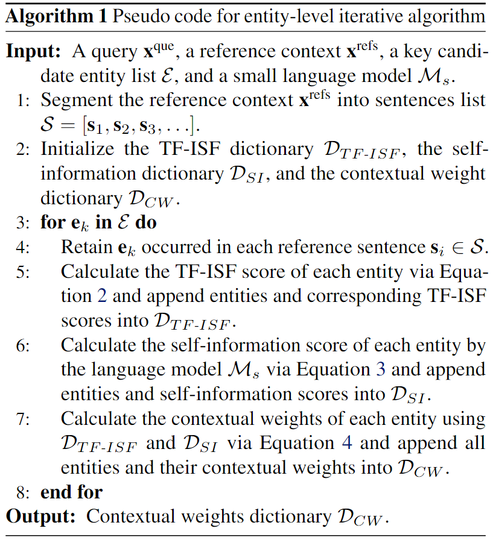

<center>
    
    <br>
    <div style="color:orange; border-bottom: 1px solid #d9d9d9;
    display: inline-block;
    color: #999;
    padding: 2px;">
      Figure 1. COFT achieves state-of-the-art performance on a broad range of long-form tasks compared with existing methods, using ChatGPT as the backbone.
  	</div>
</center>

<br>

> **TL; DR:** We introduce **COFT** (COarse-to-Fine highlighTing) to focus on different granularity-level key texts, thereby avoiding getting lost in lengthy contexts and reducing knowledge hallucination in large language models. Our COFT:
>
> - 🔥 **Over 30% improvement** in F1 score on the knowledge hallucination benchmark [FELM](https://arxiv.org/abs/2310.00741)
> - 🔥 Effectively alleviates the [Lost in the Middle](https://arxiv.org/abs/2307.03172) issue within LLMs.
> - 🔥 Exhibits remarkable versatility across various long-form tasks, such as reading comprehension and question answering.

<br>


<div class="columns is-centered has-text-centered">
    <div class="column is-four-fifths">
        <h2>Abstract</h2>
        <div class="content has-text-justified">
Generation of plausible but incorrect factual information, often termed hallucination, has attracted
significant research interest. Retrieval-augmented
language model (RALM)—which enhances models with up-to-date knowledge—emerges as a
promising method to reduce hallucination. However, existing RALMs may instead exacerbate hallucination when retrieving lengthy contexts. To
address this challenge, we propose COFT, a novel
            <b>CO</b>arse-to-<b>F</b>ine highligh<b>T</b>ing method to focus
on different granularity-level key texts, thereby
avoiding getting lost in lengthy contexts. Specifically, COFT consists of three components: recaller, scorer, and selector. First, recaller applies
a knowledge graph to extract potential key entities in a given context. Second, scorer measures
the importance of each entity by calculating its
contextual weight. Finally, selector selects high
contextual weight entities with a dynamic threshold algorithm and highlights the corresponding
paragraphs, sentences, or words in a coarse-to-fine manner. Extensive experiments on the knowledge hallucination benchmark demonstrate the
effectiveness of COFT, leading to a superior performance over 30% in the F1 score metric. Moreover, COFT also exhibits remarkable versatility
across various long-form tasks, such as reading
comprehension and question answering.
        </div>
    </div>
</div>

<div class="columns is-centered has-text-centered">
    <div class="column is-four-fifths">
        <h2>Overview of COFT</h2>
        <div class="content has-text-justified">
        </div>
    </div>
</div>


<center>
    
    <br>
    <div style="color:orange; border-bottom: 1px solid #d9d9d9;
    display: inline-block;
    color: #999;
    padding: 2px;">
      Figure 2. An overview of COFT. COFT integrates recaller, scorer, and selector into a unified framework to reduce knowledge hallucination. The workflow is as follows. (1) Perform Named Entity Recognition on the query to extract potential candidate entities. (2) Search the neighboring entities for each potential entity in the knowledge graph to enrich the candidates. (3) Retain candidates that are also present in the reference context as the final key entities. (4) Calculate the contextual weight for each key entity. (5) Calculate the threshold to filter a dynamic proportion of entities. (6) Choose the granularity for highlighting, such as word, sentence, or paragraph. (7) Highlight the reference context based on filtered entities and selected granularity.
  	</div>
</center>

<br>
We propose a COarse-to-Fine highlighTing method (COFT) that promotes LLMs to focus on key lexical units, preserving complete contextual semantics and avoiding getting lost in long contexts. COFT highlights different granularity-level lexical units in a coarse-to-fine manner, such as paragraphs, sentences, and words. COFT organically integrates three modules in a unified framework.

### Recaller
The workflow of Recaller is as follows:

(i) Recaller first conducts named entity recognition on the query to extract named entities that represent keywords within the query. These entities include specific terms and important nouns such as people, places, organizations, etc.

(ii) After obtaining named entities, Recaller leverages them to search one-hop neighbor entities in Wikidata to enrich candidate entities. The named entities and corresponding one-hop neighbors are combined to form candidate entities for the query.

(iii) Recaller finally retains candidate entities that are also present in the reference context, forming the final candidate key entities list.

<br>

### Scorer
We illustrate the Scorer algorithm in Algorithm 1.

<center>
    
    <br>
    <div style="color:orange; border-bottom: 1px solid #d9d9d9;
    display: inline-block;
    color: #999;
    padding: 2px;">
    </div>
</center>

### Selector
The workflow of Selector is as follows:

(i) Split the reference context according to the granularity of selected lexical units.

(ii) Calculate the contextual weight of the split lexical units by summing the contextual weight of candidate key entities that occurred in the split.

(iii) Sort these lexical units in descending order by their contextual weight and select the lexical units with contextual weights in the top τ × 100% for highlighting.

<br>


<div class="columns is-centered has-text-centered">
    <div class="column is-four-fifths">
        <h2>Citation</h2>
        <div class="content has-text-justified">
        </div>
    </div>
</div>

If you find our work useful your research, please cite our paper:

```
@inproceedings{lvcoarse,
  title={Coarse-to-Fine Highlighting: Reducing Knowledge Hallucination in Large Language Models},
  author={Lv, Qitan and Wang, Jie and Chen, Hanzhu and Li, Bin and Zhang, Yongdong and Wu, Feng},
  booktitle={Forty-first International Conference on Machine Learning}
}
```
